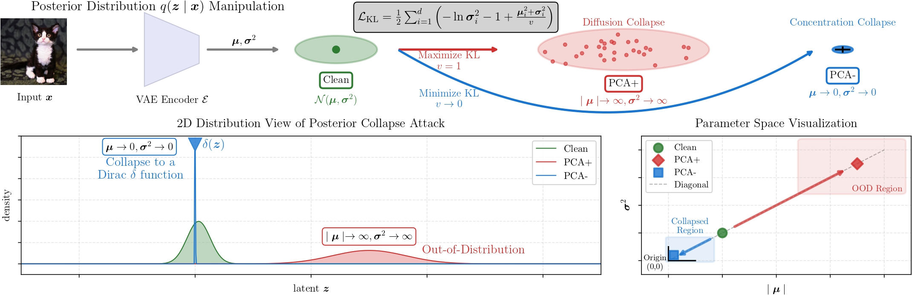

# Posterior Collapse Attack

This repo is for the method **Posterior Collapse Attack** of paper titled [A Gray-box Attack against Latent Diffusion Model-based Image
Editig by Posterior Collapse](https://arxiv.org/abs/2408.10901).

To prevent the image editing by Latent Diffusion Model (LDM), there are two protection objectives:

$$\text{Objective 1:}\quad \min_{\delta} d(f(x+\delta),x)\ \ \ \ \ \ \quad
       s.t.\,
       \Vert\delta\Vert_p \leq \epsilon,$$
       
$$\text{Objective 2:}\quad \max_{{\delta}} d(f({x}+{\delta}),f({x}))\quad
       s.t.\,
       \Vert{\delta}\Vert_{p} \leq \epsilon,$$
       
where $x$ is the image will be protected; $\delta$ is the protective perturbation; $f(\cdot)$ is a kind of LDM-based image editing method;
$d(\cdot)$ measures the perceptual distance between two inputs;
$\Vert\cdot\Vert_p$ applies a constraint to maintain visual integrity of the adversarial sample.
Intuitively, Objective 1 preserves original image content by keeping the edited adversarial sample similar to ${x}$,
while Objective 2 disrupts unauthorized editing by maximizing deviation from the expected output $f({x})$.
Both objectives prevent infringer-desired manipulations, with Objective 1 causing some distance between $f({x}+{\delta})$ and ${x}$ as a side effect.

Our method can achieve both protection objectives by a unified loss function with an adjustable hyperparameter:

$$
\mathcal{L}_{\text{PCA}}({x}) = \frac{1}{2}\sum_{i=1}^{d}\left(-\ln{\sigma}_i^2 -1 + \frac{{\mu}_i^2+{\sigma}_i^2}{v}\right).
$$

Given $v=1$ with gradient ascent, the variant method is PCA+, which will achieve the Objective 1.

Given $v=1\times 10^{-8}$ with gradient decent, the variant method is PCA-, which will achieve Objective 2.


## Environment

We used the docker image diffusers provided, and we added some libraries we used. Here we packaged the environment as a docker image, which you can get by the following command: 

```bash
docker pull zhongliangguo/posterior-collapse-attack
```

All libraries follow the original docker image, requirements:

```bash
diffusers==0.30.0.dev0
numpy==2.0.1
pandas==2.2.2
Pillow==10.4.0
torch==2.4.0
torchvision==0.19.0
tqdm==4.66.4
lpips==0.1.4
torcheval==0.0.7
```

For the `dev` version of `diffusers`, try to install from source:

```bash
pip install git+https://github.com/huggingface/diffusers
```

## Dataset

Dataset can be accessed via [here](https://github.com/ZhongliangGuo/PosteriorCollapseAttack/releases).

## How to run

### PCA+
```bash
python main.py --dataset_path "/path-to/imagenet_1k_attack/data" \
               --dataset_label "path-to/imagenet_1k_attack/label_with_caption.csv" \
               --img_size 512 \  # default size is 512
               --vae_from "sd15" \  # this will decide the surrogate VAE
               --v 1 \
               --reverse_direct
```

### PCA-
```bash
python main.py --dataset_path "/path-to/imagenet_1k_attack/data" \
               --dataset_label "path-to/imagenet_1k_attack/label_with_caption.csv" \
               --img_size 512 \  # default size is 512
               --vae_from "sd15" \  # this will decide the surrogate VAE
               --v 1e-8
```


## Citation
Consider cite us if you find our paper is useful in your research :).
```
@article{guo2024gray,
  title={A gray-box attack against latent diffusion model-based image editing by posterior collapse},
  author={Guo, Zhongliang and Lei, Chun Tong and Fang, Lei and Zhao, Shuai and Qian, Yifei and Lin, Jingyu and Wang, Zeyu and Chen, Cunjian and Arandjelovi{\'c}, Ognjen and Lau, Chun Pong},
  journal={arXiv preprint arXiv:2408.10901},
  year={2024}
}

```


